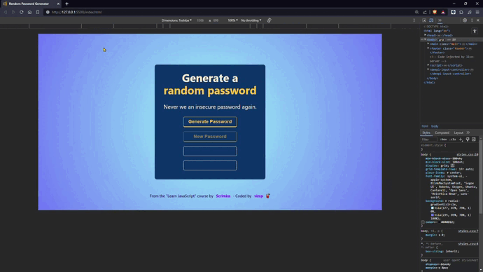

# Random Password Generator
This is a solution for the Solo Project **"Random Password Generator"** from the ["Learn JavaScript course"](https://scrimba.com/learn/learnjavascript) by [Scrimba](https://scrimba.com/).



## 📱 Mobile


## 💻 Desktop


## Demo
✨ [Click here](https://mendez-v.github.io/random-password-generator/) 👀

## I learned ..

### Spread Operator `...`
The **spread** `...` allows the elements of one iterable (such as arrays, strings or objects) to be propagated into another iterable or function call.
```js
let allCharacters = [...uppercaseAlphabet, ...lowercaseAlphabet, ...numbers, ...symbols]
```

### .removeAttribute(attrName)
`.removeAttribute` removes an attribute from the specified element.
```js
el.removeAttribute("disabled")
```

### .setAttribute(name, value)
`.setAttribute` Sets the value of an attribute on the given element. If the attribute already exists, the value is updated, otherwise the new attribute is added with the given name and value.
```js
el.setAttribute("disabled", "")
```


## Resources

🔐 [Password](https://iconscout.com/icons/password) icon by [Amru Id](https://iconscout.com/contributors/AmruID)
